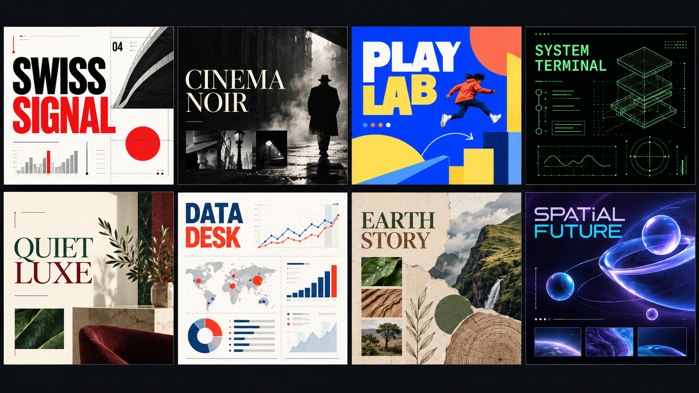

# Deckastra UI and design-language gap audit

Date: 2026-10-10

## Outcome

The largest usability problem is not styling. Deckastra currently asks one narrow editor shell and one long home-page scroll to carry too many different jobs. The redesign should separate those jobs first, then improve the visual system.

The recommended order is:

1. Separate Projects and Templates.
2. Make the editor panes resizable, collapsible, and persistent.
3. Give the assistant a full workspace, while retaining a small quick-ask drawer.
4. Add presenter ink and laser tools without duplicating the existing pause control.
5. Replace generic template thumbnails with real rendered previews and give each preset an explicit design-language contract.
6. Rebuild Account and Settings as a coherent account hub.

## Evidence from the current product

- `DeckList.tsx` mounts `NewDeckStart` before the project heading in the same `dk-decks__main` scroll. The stylesheet explicitly describes one shared scroll for the template gallery and the user's decks. This fixed the old inaccessible-deck bug, but it leaves templates competing with projects.
- Every template card is a synthetic composition made from the first slide's eyebrow and headline plus the same line and three-tile motif. It does not render the actual deck. The gallery therefore makes distinct presets look alike.
- The editor dimensions are fixed by `--dk-rail-width: 48px`, `--dk-strip-width: 176px`, and `--dk-inspector-width: 288px`. Existing commands can hide panels, but there are no visible splitters and widths cannot be dragged.
- The assistant replaces the same fixed 288 px right panel used by the inspector. Proposal explanations, controls, and before/after previews all compete for that narrow column.
- Present mode already has pause/resume, black screen, narration mute, notes, presenter view, fullscreen, and slide navigation. It has no pen, highlighter, laser pointer, eraser, or annotation layer.
- Account is currently an initials square whose menu begins with three appearance choices. Settings uses a plain two-column drawer and presents account data as facts and technical workspace rows. It does not feel like a profile or ownership hub.
- The catalog contains 24 templates, 16 themes, and seven motion styles. The underlying catalog is more varied than the gallery suggests, but several themes are reused and the template metadata does not describe a complete visual language.

## P0 — structure and core usability

### 1. Separate Templates from Projects

Create a first-class Templates destination in the home navigation. Projects should open directly to the person's decks, while Templates should provide discovery and creation.

Templates should support:

- featured families and recently used templates;
- purpose, visual language, tone, density, motion, and aspect-ratio filters;
- a large preview containing several representative slides;
- a motion sample and reduced-motion indicator;
- “Use template”, “Start with my content”, and “Ask agent to adapt” actions;
- favorites and organization-specific templates later, without changing the page architecture.

Acceptance checks:

- Opening Projects never requires scrolling past templates.
- Opening Templates never mixes personal deck cards into the catalog.
- Search has an unambiguous scope: projects or templates, never both.
- The last chosen home destination is restored on relaunch.

### 2. Make the editor workspace adjustable

Add visible drag splitters between the slide strip, canvas, inspector/assistant, and bottom dock. Keep one-click collapse buttons on every pane and expose a dedicated Focus mode.

Recommended constraints:

- slide strip: 144–320 px;
- inspector: 280–520 px;
- assistant drawer: 360–560 px;
- bottom dock: 160 px to 55% of the window height;
- double-click a splitter to reset it;
- persist dimensions per device and workspace mode;
- automatically collapse lower-priority panes when the window is too narrow.

Acceptance checks:

- At 1366×768, a 16:9 slide remains readable without manually hiding every panel.
- Every pane is both mouse-resizable and keyboard-resizable.
- Collapse controls remain visible and have tooltips and accessible names.
- Focus mode is reachable from the top bar as well as the command palette.

### 3. Give the assistant its own workspace

Use two forms of the assistant:

- Quick ask: a resizable drawer for short edits and questions.
- Assistant workspace: a full editor mode for multi-step deck work.

The full workspace should use the center for a readable slide or before/after comparison, a compact conversation/context column on the left, and a proposal queue with approve/undo on the right. The slide must remain the primary artifact; chat should not consume the largest area.

Acceptance checks:

- Before/after previews are readable at normal laptop resolution.
- A proposal can be inspected slide-by-slide before approval.
- Conversation, proposal state, and current slide remain synchronized.
- Closing Quick ask restores the previous inspector width and selection.

### 4. Add presenter annotation tools

Add a compact toolbar for:

- laser pointer with fade trail;
- pen and highlighter;
- color and thickness;
- eraser;
- undo/redo;
- clear current slide and clear all;
- temporary annotations by default, with an explicit option to save a copy.

Do not add another pause control: loop pause/resume already exists. Annotations must stay synchronized between the audience display and presenter view and must never be burned into the deck unless the presenter explicitly saves them.

Acceptance checks:

- Drawing adds no slide-navigation latency.
- Presenter and audience windows see the same stroke within one rendered frame.
- Keyboard navigation continues to work while a tool is selected.
- Escape returns to the pointer before it exits presentation mode.

## P1 — design quality and agent variety

### 5. Render real template previews

Replace the shared CSS thumbnail with exported representative slides from each preset. A card should show a real cover or signature slide; the detail view should show a five-to-eight-slide contact sheet including a text slide, data slide, image-led slide, and closing slide where available.

This is the immediate fix for the perception that every preset is the same.

Acceptance checks:

- No two cards are generated from a common placeholder composition.
- Gallery images are produced by the same deterministic renderer used for export.
- A quality check catches missing previews, clipped text, and duplicate-looking covers.

### 6. Add a design-language contract to every preset

Theme color and motion style are not enough. Each preset should declare a coherent “deck DNA” that the agent must follow:

- typography roles and scale behavior;
- grid and composition grammar;
- whitespace and content-density range;
- palette logic, not just color tokens;
- image crop, illustration, texture, and icon rules;
- chart and table language;
- shape vocabulary and border/radius rules;
- transition and element-motion grammar;
- narration/voice tone;
- prohibited combinations and fallback behavior.

The eight concepts in `deck-language-concepts.png` demonstrate the target distance between families: Swiss Signal, Cinema Noir, Play Lab, System Terminal, Quiet Luxe, Data Desk, Earth Story, and Spatial Future.

### 7. Expose art direction to the agent and the user

Before generation, let the user select or mix high-level directions instead of choosing only a template name. Show concise controls such as editorial vs. expressive, dense vs. spacious, photographic vs. graphic, calm vs. kinetic, and formal vs. playful.

The agent should receive the selected design-language contract as a hard constraint. It may vary layouts within that language, but should not silently fall back to the same neutral composition.

Acceptance checks:

- Running the same outline through three different languages produces visibly different typography, composition, imagery, data treatment, and motion—not just different colors.
- A generated deck records the chosen design language and version.
- Regenerating one slide preserves the deck language by default.

### 8. Rebuild Profile and Settings

Turn the account menu into a small identity card with avatar, name, email, plan, and credit balance, followed by clear destinations. Move appearance into Settings > Appearance rather than making it the first content in the profile menu.

Use a full settings screen or a wider responsive modal with these groups:

- Profile and account;
- Plan, credits, and billing;
- Workspaces and members;
- Agents and connected services;
- Languages, voice, and accessibility;
- Appearance;
- Privacy and data;
- About, updates, and diagnostics.

Technical details such as workspace origin and service status should be translated into plain language, with diagnostics behind an advanced section.

## P2 — cohesion, discoverability, and finish

### 9. Simplify competing modes

The product currently mixes Design/Motion/Code, an assistant toggle, insert-library panels, inspector states, notes, and a dock. Establish a clear hierarchy:

- top-level workspaces: Design, Motion, Assistant, Present;
- contextual side panels: Insert, Slides, Properties, Comments/History;
- bottom panels: Notes and Timeline.

Code can remain an advanced view rather than a peer of everyday authoring.

### 10. Improve command discoverability

Panel hiding already exists through shortcuts, but the UI does not teach it. Add visible collapse handles, a Layout menu, “Reset workspace”, and shortcut hints. First-run education should be dismissible and should never cover the working canvas with a large blocking modal.

### 11. Unify the visual system

Current surfaces range from light editorial concepts to dense dark forms and utilitarian settings. Define one product chrome system for spacing, elevation, border treatment, typography, active states, loading, empty states, alerts, and account surfaces. Deck designs can be expressive; the application shell should remain calm and consistent.

### 12. Improve status and recovery states

- Replace raw “Reading…” and “Loading…” text with stable skeletons.
- Show generation/export progress in a task center that survives navigation.
- Keep errors next to the failed action with a clear retry.
- Make approve, undo, and version history visually connected.
- Explain offline/account state without backend vocabulary.

### 13. Accessibility and responsive behavior

- Maintain usable canvas size at 1280×720 and 1366×768.
- Ensure all splitters, annotation tools, menus, and previews are keyboard operable.
- Respect reduced motion in template previews and presentation playback.
- Never rely on color alone for current tool, selection, or status.
- Test 200% zoom, long translated labels, RTL, and screen-reader names.

## Recommended implementation units

1. **Home architecture:** Templates route, Projects route, navigation, scoped search, real preview data contract.
2. **Workspace layout:** splitters, collapse buttons, focus mode, persistence, narrow-window behavior.
3. **Assistant workspace:** route/mode, large comparison canvas, proposal queue, quick drawer.
4. **Presenter tools:** ink model, synchronized overlay, toolbar, keyboard behavior, optional save.
5. **Preset visual system:** real previews, design-language schema, eight pilot families, agent constraints, diversity checks.
6. **Account and settings:** identity card, information architecture, appearance/privacy/accessibility, responsive layout.
7. **Polish gate:** loading/error/task states, accessibility pass, resolution matrix, recorded visual review.

The best first implementation unit is Home architecture. It removes the most visible structural problem and creates the correct place to expose the richer design-language system before the agent workflow is changed.
